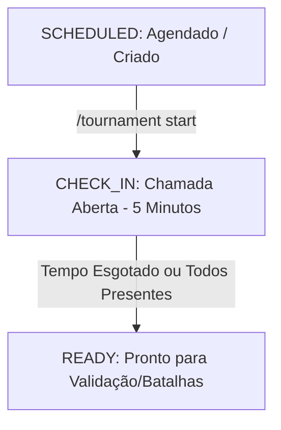

# Modos de Campeonato e Ciclo de Vida

Este documento detalha o funcionamento da arquitetura de modos de campeonato e da fase de chamada (check-in) implementadas no mod **BigBangTournaments**.

---

## 1. Modos de Campeonato

A partir da versão atual, o mod conta com uma arquitetura extensível para gerenciamento de perfis de regras por campeonato. Os modos disponíveis são:

### 1.1 Modo Standard (`standard`)
* **Nome de Exibição:** `Campeonato Padrão`
* **Descrição:** Representa o comportamento original do mod. As regras de composição da equipe utilizam estritamente o arquivo de configuração global (`tournament_config.json`).
* **Sorteio de Elemento:** Desabilitado. Os participantes não recebem tipo elemental.
* **Fallback:** É o modo utilizado por padrão para campeonatos antigos, nulos ou sem tipo definido.

### 1.2 Modo Single Type (`singletype`)
* **Nome de Exibição:** `Guerra dos Ginásios`
* **Descrição:** Torneio focado em times baseados em um único tipo de ginásio.
* **Aliases Aceitos:** `singletype`, `singleelement`, `monotype`.
* **Sorteio de Elemento:** Obrigatório. Cada participante recebe um tipo de ginásio no momento da inscrição (sem duplicação de tipos, limitado a no máximo 13 participantes).
* **Regras Específicas do Roster:**
  * **Tamanho do Time:** Exatamente 6 Pokémon.
  * **Lendários / Míticos:** Proibidos.
  * **Mecânicas Especiais:** Mega Evolução, Dynamax, Gigantamax e Z-Move são proibidos. Apenas a **Terastalização** é permitida.
  * **Composição Monotype Tradicional:** Todos os 6 Pokémon do time contêm o tipo do ginásio (como tipo primário ou secundário).
  * **Composição com Coringa (Joker):** 5 Pokémon possuem o tipo do ginásio e o 6º Pokémon (o Coringa) pode possuir qualquer tipo, desde que o seu **Tera Type** seja igual ao tipo do ginásio.

---

## 2. Ciclo de Vida e Chamada de Presença

O campeonato passa pelas seguintes fases no seu ciclo de vida:



### 2.1 Fase SCHEDULED (Criado/Agendado)
O campeonato foi criado administrativamente pelo comando `/criarcampeonato`. Os jogadores podem se inscrever livremente utilizando `/campeonato inscrever` ou `/torneio participar`.

### 2.2 Fase CHECK_IN (Confirmação de Presença)
Iniciada pelo comando `/tournament start <type>`.
* A chamada fica aberta por exatamente **5 minutos**.
* Os participantes inscritos devem usar o comando `/tournament entrar` para confirmar presença.
* Anúncios regressivos periódicos são enviados informando o tempo restante e a lista de pendentes.
* **Encerramento Antecipado:** Se todos os participantes inscritos confirmarem presença antes do tempo limite de 5 minutos, a chamada é encerrada imediatamente.
* **Recuperação após reinício:** O prazo final e o estado de confirmação dos jogadores são salvos. Caso o servidor reinicie durante esta fase, o mod recalcula o tempo restante e retoma a contagem a partir do momento salvo (ou encerra imediatamente se o prazo expirou enquanto o servidor estava offline).

### 2.3 Fase READY (Pronto para Batalhas)
A janela de entrada fechou. A staff pode agora dar prosseguimento ao campeonato executando os comandos manuais normais:
* Validação dos times (`/tournament validateall 50`)
* Preparação de times (`/tournament prepareall 50`)
* Início de batalhas (`/tournament battle <player1> <player2>`)

### 2.4 Separação entre presença e preparação
O participante passa a carregar dois estados independentes:
* `status`: ciclo de preparação do time (`REGISTERED`, `PENDING_VALIDATION`, `PREPARED`, `UNLOCKED`, `RESTORED`);
* `checkInStatus`: ciclo de presença (`NOT_STARTED`, `AWAITING`, `CHECKED_IN`, `ABSENT`).

Isso permite representar um time preparado com presença confirmada ao mesmo tempo.

---

## 3. Comandos e Comportamento

### 3.1 `/tournament start <type>`
Inicia o processo de check-in para o tipo selecionado (`standard` ou `singletype`).
* Verifica se existe campeonato agendado.
* Marca todos os inscritos como `AWAITING`.
* Emite um anúncio global com a lista de inscritos e indica quem está offline.
* Inicia a contagem regressiva de 5 minutos.
* Persiste `tournamentType` como `standard` ou `singletype`, usando esse campo como fonte canônica do modo ativo.

### 3.2 `/tournament entrar`
Utilizado pelos jogadores para confirmar presença durante a fase `CHECK_IN`.
* Apenas utilizável por jogadores já inscritos.
* Altera apenas `checkInStatus` para `CHECKED_IN`.

### 3.3 Alterações no `/tournament participant add <player>`
* **Durante a fase CHECK_IN:** O participante adicionado entra no estado `AWAITING` e deve usar `/tournament entrar`.
* **Depois da chamada (Fase READY):** O participante adicionado administrativamente é automaticamente confirmado e entra como `CHECKED_IN`.
* A presença não altera o estado de preparação do time.

### 3.4 Alterações no `/tournament participant list`
Mostra o nome, elemento de ginásio (se singletype), presença e estado de preparação de cada jogador.

---

## 4. Limitações de Fiscalização do Coringa

Devido a limitações técnicas e aos eventos disponíveis nas APIs do Cobblemon e do Mega Showdown:
* O mod identifica e armazena o UUID e o nome da espécie do Pokémon Coringa, garantindo que seu **Tera Type** seja igual ao do ginásio durante a preparação (`/tournament prepare`).
* A composição só é persistida no `prepare`; uma validação isolada não grava metadados do Coringa.
* A regra de que o Coringa deve ser o único a Terastalizar na batalha e que deve terastalizar na primeira vez que entra em campo **deve ser fiscalizada manualmente pela Staff**, pois a API atual do Cobblemon/Showdown não expõe gatilhos consistentes de Terastalização em tempo real nas batalhas de forma segura.

---

## 5. Como Criar um Novo Modo Futuramente

A arquitetura foi projetada para ser extensível. Para criar um novo modo, siga os passos abaixo:

1. **Implementar a Interface `TournamentMode`**:
   Crie uma nova classe no pacote `com.bigbang_tournaments.model` (por exemplo, `LittleCupTournamentMode`):

```java
package com.bigbang_tournaments.model;

import java.util.ArrayList;
import java.util.List;
import java.util.Set;

public class LittleCupTournamentMode implements TournamentMode {
    @Override
    public String id() {
        return "littlecup";
    }

    @Override
    public String displayName() {
        return "Little Cup";
    }

    @Override
    public Set<String> aliases() {
        return Set.of("lc");
    }

    @Override
    public boolean requiresElementAssignment() {
        return false;
    }

    @Override
    public EffectiveTournamentRules resolveRules(TournamentConfig globalConfig, TournamentState state) {
        // Little Cup herda bans globais, mas exige nível fixo 5
        return new EffectiveTournamentRules(
            globalConfig.isBanLegendaries(),
            globalConfig.isBanMythicals(),
            globalConfig.getBannedSpecies(),
            globalConfig.getBannedItems(),
            globalConfig.isItemClauseEnabled(),
            globalConfig.isSpeciesClauseEnabled(),
            false, // Sem Mega
            false, // Sem Tera
            false, // Sem Dynamax
            false, // Sem Z-Move
            globalConfig.isSingleSpecialMechanicPerTeam()
        );
    }

    @Override
    public List<TournamentRuleViolation> validateTeam(TournamentValidationContext context) {
        List<TournamentRuleViolation> violations = new ArrayList<>();
        // Regra do Little Cup: Apenas Pokémon de primeiro estágio evolucionário que podem evoluir
        for (Pokemon pokemon : context.getParty()) {
            if (pokemon.getLevel() > 5) {
                violations.add(new TournamentRuleViolation(
                    TournamentRuleViolationType.INVALID_LEVEL,
                    "Little Cup exige level exatamente 5.",
                    pokemon.getSpecies().getName()
                ));
            }
            // Adicionar validação de estágio evolucionário através da API do Cobblemon
        }
        return violations;
    }
}
```

2. **Registrar o novo modo no `TournamentModeRegistry`**:
   Abra `com.bigbang_tournaments.service.TournamentModeRegistry` e adicione no bloco `static`:

```java
    static {
        register(DEFAULT_MODE);
        register(new SingleTypeTournamentMode());
        register(new LittleCupTournamentMode()); // Novo modo registrado!
    }
```

3. **Sugestões de autocompletar**:
   Adicione o id do novo modo às sugestões do comando `/tournament start` no arquivo `TournamentCommandRegistrar.java`.

### Exemplos de Modos que Podem ser Criados
* **`littlecup`:** Restrição de nível 5 e restrições de evolução.
* **`doubles`:** Combates em formato Double Battle (2v2).
* **`random`:** Times aleatórios gerados automaticamente no início do campeonato.
* **`noitems`:** Proíbe qualquer item segurado nos Pokémon.
* **`legendary`:** Permite o uso ilimitado de lendários e míticos (desabilita cláusulas de banimento).
